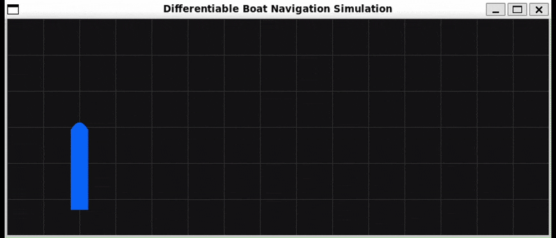
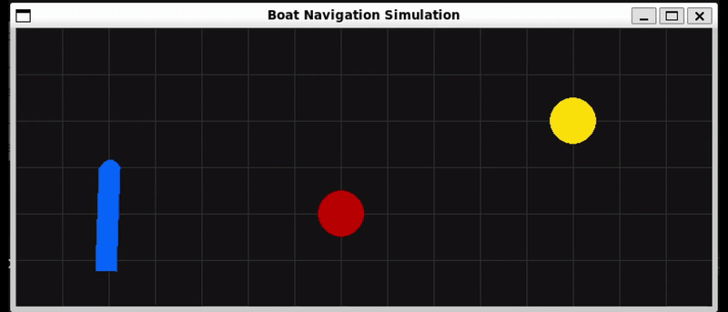
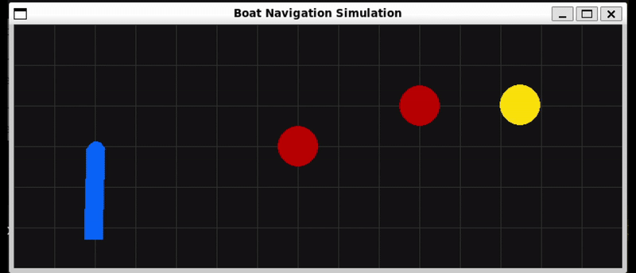

# McHorcrux

**OBS OBS UNDER DEVELOPMENT**

This repository contains **three distinct simulation and control frameworks** designed for simulating and controlling the three 6 DOF models, **C/S Arctic Drillship**, **R/V Gunnerus** and **C/S Voyager**, under wave disturbances. Developed for Kristian Magnus Roen's master's thesis in Marine Cybernetics (2025), the repository includes:

### 1. `jax_core/`
A high-performance, differentiable pipeline based on [JAX](https://github.com/jax-ml/jax) and adapted from the [mcsimpy](https://github.com/NTNU-MCS/mcsimpy) simulator. It provides **significantly enhanced computational speed** and memory efficiency, making it ideal for large-scale or repeated simulations and extensive machine learning applications. This core also features an adapted marine-focused version of the meta-trained adaptive controller from [Richards et al. (2021)](https://github.com/StanfordASL/Adaptive-Control-Oriented-Meta-Learning/tree/master) and adding model-uncertainty and training only the diagonal gains.

        TODO:
        - make a demo for how to use the controller
        - make the correct .sh file to pipeline the training and testing for reproduction.
        - Correct the readme file
        

### 2. `numpy_core/`
Features a highly modular Gym environment called **McGym**, complete with live visualization capabilities with [pygame](https://github.com/pygame/), built around the standard [mcsimpy](https://github.com/NTNU-MCS/mcsimpy) simulator. McGym follows an API structure similar to [OpenAI's Gym](https://github.com/openai/gym), offering standardized tasks and the flexibility to define custom scenarios, including dynamic or static obstacles influenced by wave motions. Ideal for **Monte Carlo simulations** or for real-time testing of custom controllers.

        TODO: 
        - Correct the readme file

### 3. `torch_core/`
A [PyTorch](https://github.com/pytorch/pytorch)-powered variant of the [mcsimpy](https://github.com/NTNU-MCS/mcsimpy) simulator designed explicitly for machine learning integration. Leveraging PyTorch’s extensive ML modules, this core excels in **reinforcement learning (RL)** and sophisticated ML-driven controller implementations, fully harnessing McGym's capabilities.

        TODO: 
        - Correct the readme file
        
---
## Demonstrations

Below are example runs showcasing the capabilities of our different McGym cores:

#### Four-corner DP in Torch McGym  
This GIF uses the **torch_core** version of McGym together with a custom `ModelController(nn.Module)`—a pure PyTorch controller that implements a PD law augmented by full model compensation. Because it’s built on `torch.nn`, you can seamlessly swap in learned networks, fine-tune gains via backpropagation, or integrate any other PyTorch module.



---

#### Static Obstacle and Goal in NumPy McGym  
Here the **numpy_core** McGym runs a static scenario: the vessel must navigate from its start point to a fixed goal while avoiding a stationary circular obstacle. The controller plans a path around the obstacle and holds final heading within the specified tolerance.  



---

#### Dynamic Obstacles and Moving Goal in NumPy McGym  
In this dynamic scenario (also using **numpy_core**), both the goal and obstacles move over time: the goal “wiggles” sinusoidally, and two circular obstacles follow independent trajectories. The controller continuously replans to track the moving goal however, it hits one of the obstacles, and the loop is then terminated.  



---

##### The mean speed ratio over wave numbers [JAX and PyTorch vs NumPy]
- **JAX is consistently fastest** Across every resolution N and every integration-step count, the JAX curve sits at least an order of magnitude lower than NumPy and well below PyTorch.
- **PyTorch overtakes NumPy for larger grids** The speed-up bars show Torch / NumPy < 1 once N ≥ 80, dropping to roughly 0.5× NumPy at N = 320.
- **Memory, not runtime, becomes the limit at large N** The QTF tensor size grows as O(N²); doubling N quadruples required RAM/VRAM.


#### Wall-clock runtime vs physical simulation time
- **NumPy’s cost explodes with N** Mean runtime rises ≈ 14 × from N = 40 to 320, while JAX rises only ≈ 3 ×.
- **Runtime scales linearly with the number of integration steps** Log-log “runtime vs steps” lines have slope ≈ 1 for all backends, meaning doubling the simulated time (or halving Δt) doubles wall-time.


---

### The waves and response of R/V Gunnerus 


---
## Installation & Requirements

You will need:

1. **Python 3.7+**
2. **Package Dependencies**
    - **Base**:
        
        ```bash
        pip install numpy matplotlib tqdm pickle pygame json scipy
        
        ```
        
    - **Torch Core**:
        
        ```bash
        pip install torch torchvision
        
        ```
        
    - **JAX Core**:
        
        ```bash
        # CPU-only JAX
        pip install -U "jax[cuda12]"
  
        ```
        
    - **mclsimpy** (Simulator for Numpy core):
        
        ```bash
        pip install git+https://github.com/NTNU-MCS/mcsimpy.git@master
        
        ```   

## Contributing

Pull requests and issues are welcome! 

---

## License

Distributed under the [MIT License](LICENSE).  
See the repository root for details.
```
